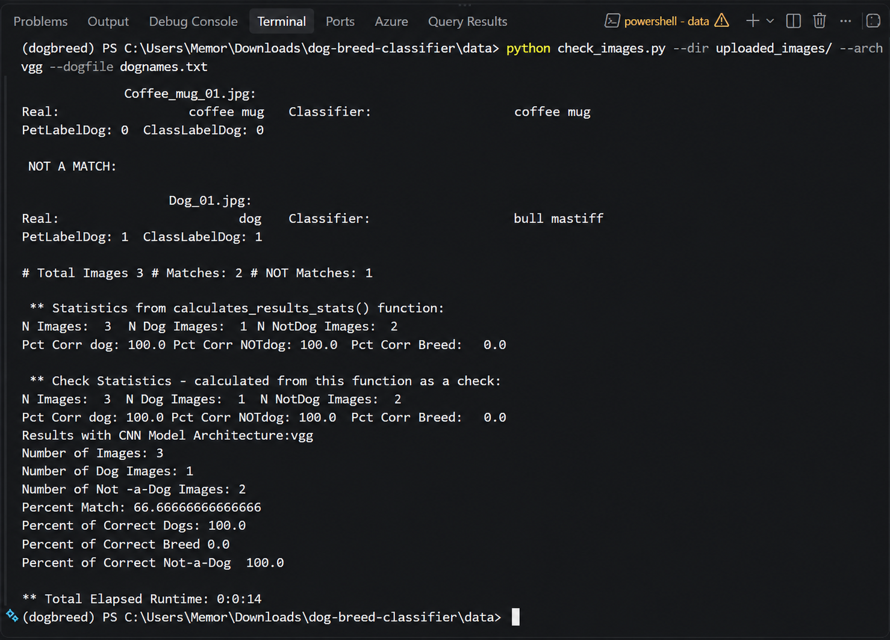

# Dog Breed Classifier 🐶

A computer vision project that uses pretrained Convolutional Neural Network (CNN) models to identify dogs in images and predict their breed.


## 📌 Project Overview

This project explores image classification using pretrained deep learning models. It processes pet images, identifies whether an image contains a dog, and predicts the breed of dog images.

The project includes experiments with three pretrained CNN architectures:

- VGG
- ResNet
- AlexNet

## ✨ Features

- Identifies whether an image contains a dog
- Predicts the breed of a dog
- Classifies uploaded images
- Evaluates classification results
- Calculates statistics for model performance
- Includes sample pet images and uploaded test images
- Supports multiple pretrained CNN architectures

## 🛠️ Technologies

- Python
- PyTorch
- Torchvision
- Pretrained CNN models
- VS Code
- Git
- GitHub

## 📂 Project Structure

```text
dog-breed-classifier/
│
├── data/
│   ├── pet_images/
│   ├── uploaded_images/
│   ├── classifier.py
│   ├── check_images.py
│   ├── classify_images.py
│   ├── get_pet_labels.py
│   ├── calculates_results_stats.py
│   ├── adjust_results4_isadog.py
│   ├── print_results.py
│   ├── test_classifier.py
│   └── ...
│
├── .gitignore
└── README.md
```

├── .gitignore
└── README.md
```

## 🧪 Example Test & Results

A small test was performed using three uploaded images with the VGG model:

| Metric | Result |
|---|---:|
| Model | VGG |
| Images tested | 3 |
| Dog images | 1 |
| Non-dog images | 2 |
| Overall exact match | 66.7% |
| Correct dog detection | 100% |
| Correct non-dog detection | 100% |
| Correct breed prediction | 0% |
| Runtime | 14 seconds |

The classifier correctly identified the dog and non-dog images in this small sample. The dog image was identified as a dog, but the predicted breed was **bull mastiff** rather than the expected label.

> **Note:** This is a very small test sample and should not be interpreted as the overall accuracy of the model.